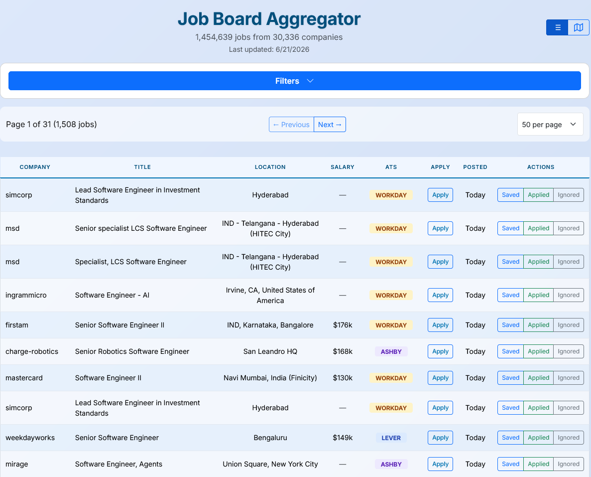

# Job Board Aggregator



Automated job board aggregating 1,000,000+ positions from 20,000+ companies across seven major ATS platforms. Updated daily via GitHub Actions.

## Live Site

[View Job Board](https://feashliaa.github.io/job-board-aggregator)

## Features

- **Multi-platform scraping**: Greenhouse, Lever, Ashby, BambooHR, iCIMs, Paylocity, and Workday APIs scraped in parallel using `concurrent.futures`
- **Progressive loading**: Chunked gzip data loaded via Web Workers for fast initial render
- **Advanced filtering**: Filter by title, company, location, ATS platform, experience level, and exclude keywords. Toggle remote-only, hide recruiter postings, or hide already-applied jobs
- **Job tier classification**: Automatic skill-level tagging (intern/entry/mid/senior) using weighted keyword scoring on job titles
- **Application tracking**: Mark jobs as saved, applied, or ignored with batch update support via localStorage
- **URL state sync**: Filter/sort/page state persisted in the URL for shareable/bookmarkable searches
- **Responsive design**: Desktop table view with card-based mobile layout
- **Automated pipeline**: Daily GitHub Actions workflow: fetch existing data → scrape → merge → push chunks to the data repo → create release
- **Trend tracking + anomaly detection**: Daily per-platform counts are appended to a trend log; a check flags any platform whose volume deviates sharply from its recent baseline and opens a GitHub issue
- **Interactive heatmap**: Map view showing job density by location


## Tech Stack

| Layer    | Tools                                                  |
| -------- | ------------------------------------------------------ |
| Frontend | Vanilla JavaScript (ES Modules), Bootstrap 5, HTML/CSS |
| Scraping | Python 3.12, `requests`, `concurrent.futures`, `gzip`  |
| Data     | Chunked gzip JSON, Web Workers for decompression       |
| CI/CD    | GitHub Actions (daily cron + manual dispatch)          |
| Hosting  | GitHub Pages (app), plus a second Pages site for data  |

## Architecture

```
scripts/
├── scraper.py          # Multi-ATS scraper with parallel fetching
├── merge_data.py       # Deduplicates and prunes stale jobs (>30 days)
├── geolocation.py      # Location lookup/enrichment for the heatmap
└── check_anomalies.py  # Per-platform volume anomaly detection on the trend log

filter_jobs/
├── filter_jobs.py      # Download published chunks and filter/export locally (no scrape)
├── README.md           # Usage and all CLI filter parameters
└── archive/            # Date-stamped local exports (gitignored)

js/
├── app.js              # Main app class and initialization
├── jobs_loader.js      # Progressive chunk loading + Web Worker orchestration
├── chunk_worker.js     # Web Worker for gzip decompression
├── filters.js          # Filter logic with regex matching
├── sort_logic.js       # Client-side sort with alpha/numeric handling
├── renderer.js         # Table/card rendering with pagination
├── storage.js          # localStorage wrapper for application tracking
├── columns.js          # Column definitions and custom renderers
├── events.js           # Event listener setup
├── url_state.js        # URL query string sync
└── ui_utils.js         # Toast notifications, HTML escaping, utilities

data/
├── *_companies.json    # Company lists per ATS platform (tracked on main)
├── salary/             # Salary lookup table, sharded a-z (static input)
├── locations.json      # Geolocation lookup
└── trends/daily.jsonl  # Append-only daily trend history (one JSON object per line)

# Chunked job data (jobs_chunk_*.json.gz + jobs_manifest.json) is NOT in this repo.
# Each run force-pushes it to a separate data repo (Feashliaa/job-board-data),
# which serves the chunks over its own GitHub Pages site (Fastly-backed CDN).
# This keeps the code repo small and code-only while the data repo stays flat
# (force-pushed each run, so it never accumulates history).
```

## Data Pipeline

1. **Scrape**: `scraper.py` fetches jobs from all seven ATS APIs concurrently. Worker counts are tuned per platform to respect each one's rate limits: 50 for Workday, 30 for Greenhouse/Lever/iCIMs, 10 for BambooHR, and 5 for Ashby/Paylocity (the tightest limiters).
2. **Classify**: Each job is tagged with a skill level based on title keywords and flagged if posted by a recruiting agency
3. **Clean**: Jobs missing titles, URLs, or company info are dropped
4. **Chunk**: Results are split into ~25k-job gzipped chunks with a manifest file
5. **Merge**: `merge_data.py` deduplicates against existing data and prunes jobs older than 30 days
6. **Monitor**: A daily trend snapshot (per-platform and per-tier counts) is appended to `data/trends/daily.jsonl` and committed to main. `check_anomalies.py` compares each platform against its recent baseline and opens an issue if one drops off or spikes abnormally.
7. **Deploy**: GitHub Actions force-pushes the regenerated chunks to the separate `job-board-data` [repo](https://github.com/Feashliaa/job-board-data) and creates a tagged release on main. The frontend fetches chunks from the data repo's GitHub Pages site, keeping the main repo code-only.

## Company Discovery

Company lists are built from Common Crawl index data using a separate harvesting pipeline. The harvester scans CDX archives for URLs matching 20+ ATS domain patterns, extracts company slugs via regex, and deduplicates across multiple crawl snapshots. This currently yields give or take 95,000 unique company identifiers.

## Local Development

```bash
git clone https://github.com/Feashliaa/job-board-aggregator.git
cd job-board-aggregator
python -m http.server 8000
# Visit http://localhost:8000
```

The frontend fetches live chunk data from the data repo's Pages site over the network, so local development works against current data without needing the chunks checked out locally.

### Filter published jobs to local files (no scrape)

To download the already-published chunk data and keep filtered results on disk (default: United States, remote-only, last 24 hours, hide recruiters, **IT title keywords**), see **[filter_jobs/README.md](filter_jobs/README.md)**:

```bash
cd filter_jobs
python filter_jobs.py
# writes filter_jobs/archive/YYYY-MM-DD_HHMMSS/{filters.json,jobs.json,urls.txt,jobs.csv}
```

## Keeping up to date

There are two different “updates”:

| What | Where it lives | What you do |
|------|----------------|-------------|
| **Job listings** (titles, URLs, dates) | [job-board-data](https://feashliaa.github.io/job-board-data/) (updated daily) | Nothing in Git. The site and `filter_jobs.py` already fetch this over the network. |
| **This repo’s code** (UI, scraper, company lists, `filter_jobs`) | GitHub | Pull this repo for *our* changes. To also take **upstream** (original) code updates, use the shallow sync below. |

This copy of the project is a **small snapshot** (current files only). The original repo ([Feashliaa/job-board-aggregator](https://github.com/Feashliaa/job-board-aggregator)) still has a very large Git history. A normal `git pull upstream main` would download that history and can fail or bloat the repo. **Do not merge the full upstream history.**

### Sync latest *files* from upstream (anyone can do this)

If you cloned **this** repository (not only the original), you can still receive upstream code updates. Add the original repo as `upstream`, fetch **only the latest commit**, and copy its files:

```bash
# once
git remote add upstream https://github.com/Feashliaa/job-board-aggregator.git

# each time you want upstream’s latest files
git fetch --depth 1 upstream main
git checkout upstream/main -- .
```

`git checkout upstream/main -- .` copies the original project’s current files on top of yours. The original repo has no `filter_jobs/` folder, so that folder is usually left as-is. Shared files such as `README.md` and `.gitignore` **are** overwritten. If you want to keep this repo’s versions of those two files:

```bash
git checkout HEAD -- README.md .gitignore
```

Then finish the sync:

```bash
git add -A
git reset -- .venv filter_jobs/archive
git status
git commit -m "Sync files from upstream"
```

After that, `filter_jobs.py` and the UI still load **job listings** from the public data site, so you do not need to scrape or pull job chunks from Git.

**Yes — someone else who cloned your repo can do the same.** They add `upstream` themselves and run the shallow fetch. They do not need your 6GB local `.git` pack.

To run the scraper locally:

```bash
cd scripts
pip install -r requirements.txt
python scraper.py --source manual
```

## License

Code in this repository is licensed under the MIT License - see the [LICENSE](LICENSE) file for details.

The curated company datasets in `data/` are licensed under [CC BY-NC 4.0](https://creativecommons.org/licenses/by-nc/4.0/). You're free to use, modify, and share the data for non-commercial purposes. Commercial use of the datasets requires permission - reach out via [GitHub Issues](https://github.com/Feashliaa/job-board-aggregator/issues) or email.

---

Built by [Riley Dorrington](https://github.com/Feashliaa)
